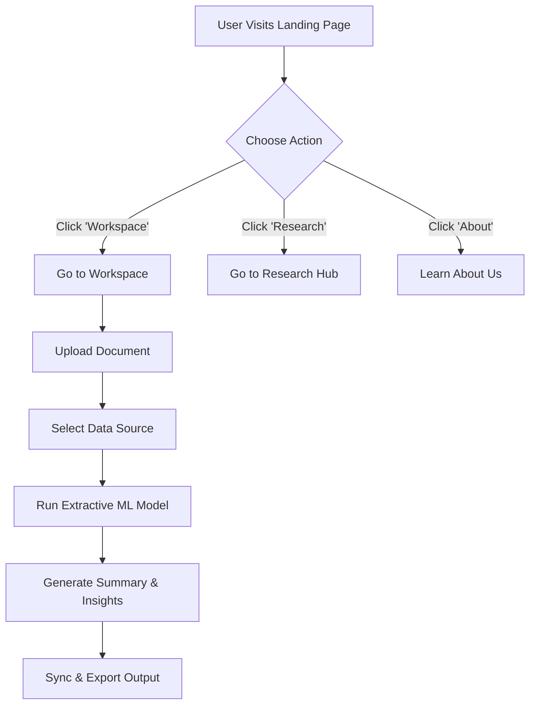

<div align="center">
  <div style="background-color: #fff; display: inline-block; padding: 10px; border-radius: 50%;">
      
  </div>
  <h1 align="center">Med.AI</h1>
  
  <p align="center">
    <strong>Transform dense healthcare policy briefs into actionable insights with state-of-the-art NLP.</strong>
    <br />
    <a href="https://github.com/afzalkhanofficial/Med-AI"><strong>Explore the docs »</strong></a>
    <br />
    <br />
    <a href="#">View Demo</a>
    ·
    <a href="https://github.com/afzalkhanofficial/Med-AI/issues">Report Bug</a>
    ·
    <a href="https://github.com/afzalkhanofficial/Med-AI/issues">Request Feature</a>
  </p>
</div>

<!-- Badges -->
<div align="center">
  
  
  
  
</div>

<!-- Contributors -->
<div align="center">
  <h3>Contributors</h3>
  <table>
    <tr>
      <td align="center">
        <a href="https://github.com/afzalkhanofficial">
          
        </a>
        <br />
        <strong>Afzal</strong>
      </td>
      <td align="center">
        <a href="https://github.com/Tejaswani-Chauhan">
          
        </a>
        <br />
        <strong>Tejaswani</strong>
      </td>
    </tr>
  </table>
</div>

---

## 📖 About The Project

**Med.AI** is your fastest path to medical policy summarization and entity extraction. We understand that medical professionals and researchers spend countless hours analyzing dense healthcare policy briefs, clinical trials, and research papers. 

Our mission is to save you time by preserving context while running advanced extractive ML models to identify key entities and generate summaries instantly.

### ✨ Key Features

* **Instant Document Processing:** Upload Policy Documents, Clinical Trials, Research Papers, or Patient Logs and get them processed in milliseconds.
* **Extractive ML Models:** Employs advanced extractive models (e.g., Med-BERT-v4) to summarize data without losing crucial context.
* **Format Agnostic:** Support for multiple formats (PDF, JSON, Text, etc.). *"Whatever your format, it processes on Med.AI."*
* **Automatic Sync:** Seamless, automatic updates to stay current with dynamic policy changes.
* **Elegant UI:** A stunning dark-mode interface built with Tailwind CSS, Vanta.js globe interactions, and smooth animations.

---

## 🛠️ Built With

* [HTML5](https://developer.mozilla.org/en-US/docs/Web/Guide/HTML/HTML5)
* [Tailwind CSS](https://tailwindcss.com/)
* [JavaScript](https://developer.mozilla.org/en-US/docs/Web/JavaScript)
* [Vanta.js](https://www.vantajs.com/)
* [FontAwesome](https://fontawesome.com/)
* [Google Fonts (Inter, JetBrains Mono)](https://fonts.google.com/)

---

## 🚀 User Flow



---


## 💻 Getting Started

This project consists of an interactive front-end that connects to powerful NLP back-ends. The front-end can be run as a static website.

### Prerequisites

You simply need a modern web browser (e.g., Chrome, Firefox, Safari, Edge). 
For active development, a local server is recommended to view module interactions without CORS issues.

### Installation

1. Clone the repo
   ```sh
   git clone https://github.com/afzalkhanofficial/Med-AI.git
   ```
2. Navigate to the project directory
   ```sh
   cd Med-AI
   ```
3. Open `index.html` in your browser, or start a local server:
   ```sh
   # If you use python
   python -m http.server 8000
   
   # If you use Node.js
   npx serve .
   ```
4. Access the app by navigating to `http://localhost:8000` (or `http://localhost:3000` for `serve`).

---

## 📜 License

Distributed under the MIT License. See `LICENSE` for more information.

<div align="center">
  <br />
  Made with 💜 by the <b>Med.AI</b> team
</div>
